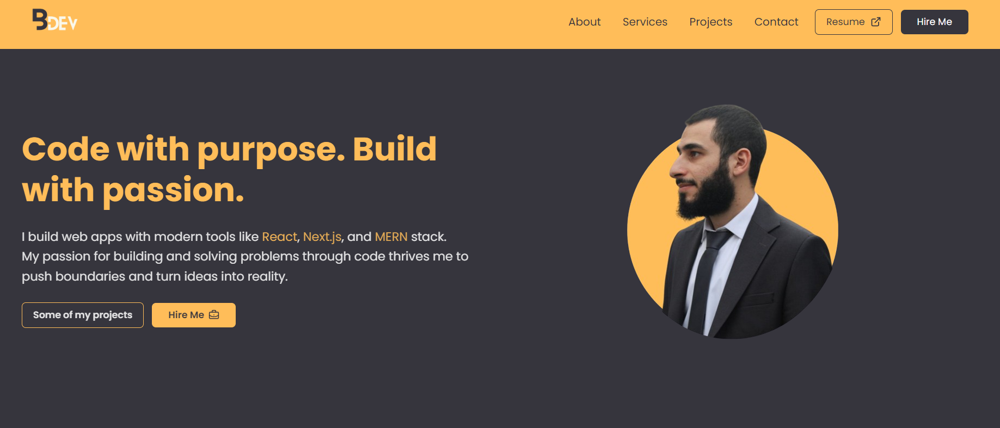
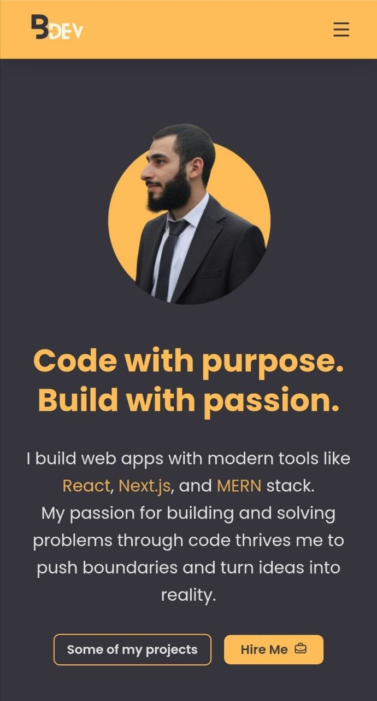

# BDev

**My personal website.**

---

## Tech Stack

- **Frontend:** [React](https://react.dev/) + Vite, [TailwindCSS](https://tailwindcss.com/) for styling.
- **UI/UX:** Used some components from [Sera UI](https://seraui.com/), [Lucide](https://lucide.dev/icons/) & [React Icons](https://react-icons.github.io/react-icons/) icons, Framer Motion for animations, and [React Hot Toast](https://react-hot-toast.com/) for cool toasts.
- **Email Service:** Used [EmailJS](https://www.emailjs.com/) to easily configure and send emails.

---

## Preview

### Desktop View

### Mobile View

---

## Live Demo

Deployed on Vercel 👉 <a href="https://bdev-lb.vercel.app" target="_blank">bdev-lb.vercel.app</a>

---

## Contribution

Love this project? **Drop** a star ⭐ and feel free to **fork** it or **suggest improvements** if you find something cool!
